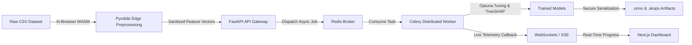

# 🚀 DataPilot — Enterprise AutoML & Edge Preprocessing Platform

[-black?style=flat-square&logo=next.js)](https://nextjs.org/)
[-009688?style=flat-square&logo=fastapi)](https://fastapi.tiangolo.com/)
[](https://pyodide.org/)
[](https://docs.celeryq.dev/)
[](https://www.docker.com/)
[](LICENSE)

**DataPilot** is a full-stack automated machine learning (AutoML) platform designed for data privacy, high performance, and seamless production deployment. It combines **zero-knowledge in-browser WebAssembly preprocessing** with a **distributed asynchronous backend training engine**, **Bayesian hyperparameter optimization**, **game-theoretic model explainability (TreeSHAP)**, and **secure model artifact serialization (ONNX & Skops)**.

---

## 🌟 Live Demo & Repositories

- **Frontend (Vercel):** [https://ml-dashboard-livid-pi.vercel.app](https://ml-dashboard-livid-pi.vercel.app)
- **Backend (Render):** [https://ml-dashboard-vqs0.onrender.com](https://ml-dashboard-vqs0.onrender.com)
- **Source Code (GitHub):** [https://github.com/Shambhujadhav4/ML_Dashboard](https://github.com/Shambhujadhav4/ML_Dashboard)

---

## ✨ Key Features & Architecture



### 1. ⚡ Zero-Knowledge Edge Preprocessing (WebAssembly / Pyodide)
- Executes Pandas, NumPy, and Scikit-Learn pipelines **locally inside a browser Web Worker** via Pyodide (WASM).
- Data cleaning, missing value imputation, categorical encoding, feature scaling, and outlier removal happen on the client machine before transmission, ensuring privacy and eliminating unnecessary server latency.

### 2. 📊 Automated Dataset Analysis & Profiling
- Ingests CSV and TSV files with automatic delimiter detection and encoding resolution.
- Automatically determines task type (**Binary Classification**, **Multiclass Classification**, or **Regression**).
- Analyzes feature statistics, class distributions, null value patterns, and recommends target columns.

### 3. 🧠 Intelligent Dual-Metric Model Recommendation Engine
- Automatically benchmarks candidate algorithms:
  - **Classification:** Random Forest, Gradient Boosting, XGBoost, LightGBM, CatBoost, Logistic Regression.
  - **Regression:** Random Forest, Gradient Boosting, Linear Regression, Ridge, Lasso.
- Transparent dual-metric scoring (**Weighted F1-Score + Accuracy** for classification; **R² + RMSE** for regression) with Stratified K-Fold cross-validation.

### 4. 🚀 Distributed Asynchronous Training Engine
- Offloads heavy training workloads to **Celery workers** backed by **Redis**, keeping the web server non-blocking and responsive.
- Streams live training progress, loss metrics, and epoch logs back to the frontend over **WebSockets** (`/api/train/ws/{task_id}`) and SSE fallback.
- Graceful in-process background execution fallback when Redis is not present in lightweight environments.

### 5. 🎯 Bayesian Optimization (Optuna) & Explainability (TreeSHAP)
- Automated hyperparameter tuning using Bayesian Optimization via **Optuna** with median trial pruning.
- Game-theoretic feature interpretability using **TreeSHAP**, generating interactive SHAP summary plots and feature importance rankings.

### 6. 🔒 Secure Serialization & Cross-Platform Artifacts
- **ONNX Export (`.onnx`):** High-performance, portable serialization for microsecond production inference in C++, Go, Node.js, Rust, or Python.
- **Skops Export (`.skops`):** Secure AST allowlist-validated Python model binaries that protect against Arbitrary Code Execution (ACE) vulnerabilities inherent to legacy `.pkl` pickle files.

### 7. 📈 Interactive Visualizations & Modern UI
- Interactive Plotly.js charts: Missing value heatmaps, correlation matrices, distribution histograms, box plots, scatter plots, confusion matrices, ROC/PR curves, and Optuna optimization history.
- Sleek dark theme with glassmorphic cards, responsive mobile design, and subtle 3D tilt micro-interactions.

---

## 💻 Technology Stack

| Layer | Technologies |
|---|---|
| **Frontend** | Next.js 15 (App Router), React 19, TypeScript, Vanilla CSS (Dark Glassmorphic Theme), Plotly.js |
| **Edge Runtime** | Pyodide (WebAssembly), Dedicated Web Workers |
| **Backend API** | FastAPI (Python 3.13), Uvicorn, Gunicorn, Pydantic v2, WebSockets |
| **ML Engine** | Scikit-Learn, Pandas, NumPy, XGBoost, LightGBM, CatBoost, Optuna, SHAP, Skops, ONNX |
| **Task Queue** | Celery 5, Redis 7 |
| **DevOps & Proxy** | Docker, Docker Compose, Nginx (Reverse Proxy & WebSocket Upgrades) |

---

## 📂 Project Directory Structure

```text
DataPilot/
├── docker-compose.yml           # Unified production multi-container orchestration
├── .env.example                 # Environment variables template
├── .gitignore                   # Git ignore rules for data, secrets & caches
├── README.md                    # Project documentation
├── PROJECT_RESUME.md            # Detailed engineering portfolio summary
│
└── website/
    ├── backend/                 # FastAPI ML Engine & API
    │   ├── Dockerfile           # Python 3.13 + Gunicorn container build
    │   ├── requirements.txt     # Python dependencies
    │   ├── app/
    │   │   ├── main.py          # FastAPI application entrypoint & CORS setup
    │   │   ├── api/routes/      # REST & WebSocket route handlers
    │   │   │   ├── health.py    # Health checks
    │   │   │   ├── upload.py    # Ingestion & dataset snapshot endpoints
    │   │   │   ├── preprocess.py# Transformation endpoints
    │   │   │   ├── train.py     # Training dispatch, WS telemetry & downloads
    │   │   │   ├── visualize.py # Plotly visualization figures & SHAP endpoints
    │   │   │   └── predict.py   # Model inference endpoints
    │   │   ├── core/            # Config, Celery app & execution runners
    │   │   ├── schemas/         # Pydantic request & response models
    │   │   ├── services/        # Business logic (recommendation, dataset, training)
    │   │   └── tasks/           # Celery background training tasks
    │   ├── modules/             # Core ML algorithms & visualization generators
    │   └── test_*.py            # Integration test suites
    │
    ├── frontend/                # Next.js 15 User Interface
    │   ├── Dockerfile           # Multi-stage Node 20 container build
    │   ├── package.json         # Node dependencies
    │   ├── tsconfig.json        # TypeScript configuration
    │   ├── app/                 # Next.js App Router pages
    │   │   ├── page.tsx         # Landing page & platform overview
    │   │   ├── upload/          # Dataset upload & initial inspection
    │   │   ├── exploration/     # EDA & interactive Plotly charts
    │   │   ├── preprocessing/   # Data cleaning & transformation dashboard
    │   │   ├── training/        # Algorithm selection & training launcher
    │   │   └── results/         # Metrics, SHAP explainability & downloads
    │   ├── components/          # Reusable UI components & chart wrappers
    │   ├── lib/                 # API client, Pyodide WASM worker & session state
    │   └── public/              # Static assets & Pyodide worker script
    │
    └── nginx/                   # Nginx reverse proxy
        └── default.conf         # HTTP, WebSocket & API reverse proxy configuration
```

---

## 🚀 Running Locally

### Option 1: One-Command Setup with Docker Compose (Recommended)

Make sure you have [Docker](https://docs.docker.com/get-docker/) installed.

```bash
# Clone the repository
git clone https://github.com/Shambhujadhav4/ML_Dashboard.git
cd ML_Dashboard

# Start the full stack (Redis, Backend, Celery Worker, Frontend, Nginx)
docker compose up --build
```

- **Frontend Application:** `http://localhost:3000` (or `http://localhost` via Nginx)
- **Backend API Docs:** `http://localhost:8000/docs`
- **Redis Broker:** `localhost:6379`

---

### Option 2: Manual Development Setup

#### 1. Start Redis (Required for Celery)
```bash
# Using Docker for Redis:
docker run -d -p 6379:6379 --name datapilot-redis redis:7-alpine
```

#### 2. Start the Backend & Celery Worker
```bash
cd website/backend

# Create and activate virtual environment
python -m venv .venv

# Windows:
.venv\Scripts\activate
# macOS / Linux:
source .venv/bin/activate

# Install dependencies
pip install -r requirements.txt

# In Terminal 1: Start FastAPI
uvicorn app.main:app --reload --host 0.0.0.0 --port 8000

# In Terminal 2: Start Celery Worker
celery -A app.core.celery_app.celery_app worker --loglevel=info -c 2 --pool=threads
```

#### 3. Start the Frontend
```bash
cd website/frontend

# Install dependencies
npm install

# Start Next.js development server
npm run dev
```
*Access the app at `http://localhost:3000`.*

---

## 🌐 Production VPS Deployment Guide

Deploy DataPilot to any Linux Virtual Private Server (e.g. DigitalOcean Droplet, AWS EC2, Hetzner, Linode, Vultr, Ubuntu 22.04/24.04 LTS).

### 1. VPS Prerequisites
- **OS:** Ubuntu 22.04 / 24.04 LTS (or any modern Linux distribution)
- **Hardware:** Minimum 2GB RAM (4GB+ recommended for heavy gradient boosting / Optuna runs), 2 vCPUs, 20GB+ SSD.

### 2. Install Docker & Docker Compose on your VPS
SSH into your server and run:
```bash
sudo apt update && sudo apt upgrade -y
sudo apt install -y curl git ufw

# Install Docker Engine & Docker Compose Plugin
curl -fsSL https://get.docker.com -o get-docker.sh
sudo sh get-docker.sh

# Enable Docker service
sudo systemctl enable --now docker
```

### 3. Clone Repository & Configure Environment
```bash
# Clone the repository
git clone https://github.com/Shambhujadhav4/ML_Dashboard.git
cd ML_Dashboard

# Create your production environment file
cp .env.example .env
```

Edit `.env` using `nano .env`:
```env
DOMAIN_NAME=yourdomain.com
DATAPILOT_CORS_ORIGINS=http://yourdomain.com,https://yourdomain.com,http://localhost
NEXT_PUBLIC_API_BASE_URL=/api
NEXT_PUBLIC_WS_BASE_URL=
```

### 4. Build and Launch Containers
```bash
# Build and start all services in detached mode
sudo docker compose up -d --build

# Verify all 5 containers are running healthy
sudo docker compose ps
```

### 5. Configure Firewall (UFW)
```bash
sudo ufw allow 22/tcp    # SSH
sudo ufw allow 80/tcp    # HTTP
sudo ufw allow 443/tcp   # HTTPS
sudo ufw enable
```

### 6. Enable Free HTTPS / SSL with Let's Encrypt (Certbot)
To secure your domain with SSL:
```bash
# Install Certbot
sudo apt install -y certbot

# Obtain certificate (Stop nginx briefly to free port 80 during cert generation)
sudo docker compose stop nginx
sudo certbot certonly --standalone -d yourdomain.com -d www.yourdomain.com

# Mount certificates into nginx and restart
sudo docker compose up -d
```

### 7. Maintenance & Useful Commands
```bash
# View live logs across all containers
sudo docker compose logs -f

# View Celery training logs specifically
sudo docker compose logs -f celery_worker

# Restart the application
sudo docker compose restart

# Update to latest version
git pull
sudo docker compose up -d --build
```

---

## 📡 Core API Reference

| Endpoint | Method | Description |
|---|---|---|
| `/api/health` | `GET` | Service health status check |
| `/api/upload/file` | `POST` | Upload and profile CSV/TSV dataset |
| `/api/upload/{projectId}` | `GET` | Fetch project snapshot & metadata |
| `/api/upload/{projectId}/workflow-recommendation` | `GET` | Generate model & preprocessing recommendations |
| `/api/preprocess/{projectId}/apply` | `POST` | Apply transformations (imputation, scaling, encoding) |
| `/api/train` | `POST` | Dispatch asynchronous model training task (HTTP 202) |
| `/api/train/status/{taskId}` | `GET` | Poll training status and metrics |
| `/api/train/ws/{taskId}` | `WebSocket` | Real-time training telemetry & progress stream |
| `/api/train/{projectId}/artifact` | `GET` | Download `.skops` or `.onnx` model binary |
| `/api/visualize/{projectId}/*` | `GET` | Fetch Plotly JSON figures (EDA, SHAP, Optuna history) |

---

## 📄 License

This project is open-source and licensed under the [MIT License](LICENSE).
