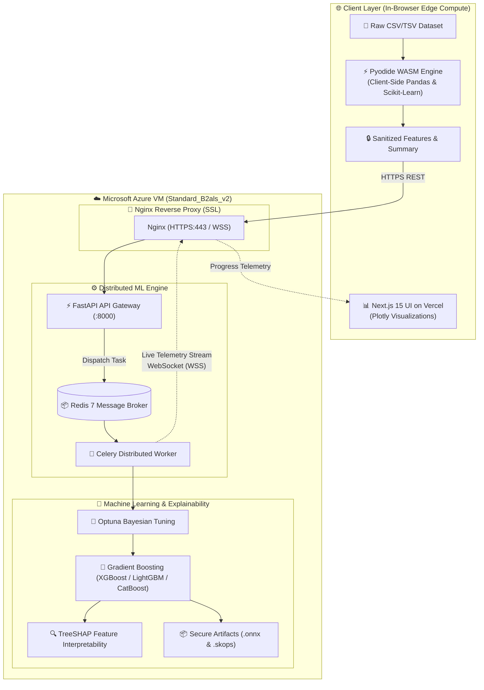

# 🚀 WasmBoost (Distributed AutoML Platform)

[-black?style=flat-square&logo=next.js)](https://nextjs.org/)
[-009688?style=flat-square&logo=fastapi)](https://fastapi.tiangolo.com/)
[](https://pyodide.org/)
[](https://docs.celeryq.dev/)
[](https://www.docker.com/)
[](https://wasm-boost.vercel.app)
[](https://wasmboost-api.uaenorth.cloudapp.azure.com)
[](LICENSE)

**WasmBoost** is an enterprise-grade, full-stack distributed automated machine learning (AutoML) platform designed for absolute data privacy, high-performance training, and seamless production deployment. It combines **zero-knowledge in-browser WebAssembly preprocessing** with a **distributed asynchronous backend training engine**, **Bayesian hyperparameter optimization (Optuna)**, **game-theoretic model explainability (TreeSHAP)**, and **secure model artifact serialization (ONNX & Skops)**.

---

## 🌟 Live Production Deployment

- 🌐 **Frontend (Vercel Global Edge):** [https://wasm-boost.vercel.app](https://wasm-boost.vercel.app)
- ⚡ **Backend API & WebSockets (Microsoft Azure VM):** [https://wasmboost-api.uaenorth.cloudapp.azure.com](https://wasmboost-api.uaenorth.cloudapp.azure.com)
- 📦 **Source Code (GitHub):** [https://github.com/Shambhujadhav4/WasmBoost](https://github.com/Shambhujadhav4/WasmBoost)

---

## 🏗️ Platform Architecture



---

## ✨ Key Features

### 1. ⚡ Zero-Knowledge Edge Preprocessing (WebAssembly / Pyodide)
- Executes Pandas, NumPy, and Scikit-Learn pipelines **locally inside a dedicated browser Web Worker** via Pyodide (WASM).
- Data cleaning, missing value imputation, categorical encoding, feature scaling, and outlier removal execute on the client device before any transmission, guaranteeing zero-knowledge data privacy and 0 ms local latency.

### 2. 📊 Automated Dataset Analysis & Profiling
- Ingests CSV and TSV files with automatic delimiter detection and encoding resolution.
- Automatically determines task type (**Binary Classification**, **Multiclass Classification**, or **Regression**).
- Analyzes feature statistics, class distributions, null value patterns, and recommends target columns.

### 3. 🧠 Intelligent Dual-Metric Model Recommendation Engine
- Automatically benchmarks candidate algorithms:
  - **Classification:** Random Forest, Gradient Boosting, XGBoost, LightGBM, CatBoost, Logistic Regression.
  - **Regression:** Random Forest, Gradient Boosting, Linear Regression, Ridge, Lasso.
- Transparent dual-metric scoring (**Weighted F1-Score + Accuracy** for classification; **R² + RMSE** for regression) with Stratified K-Fold cross-validation.

### 4. 🚀 Distributed Asynchronous Training Engine (Celery + Redis)
- Heavy ML workloads are offloaded to **Celery workers** backed by **Redis**, keeping the FastAPI server non-blocking and responsive.
- Streams live training progress, loss metrics, and epoch logs back to the frontend over **WebSockets** (`/api/train/ws/{task_id}`).
- Graceful in-process background execution fallback when Redis is absent in lightweight environments.

### 5. 🎯 Bayesian Optimization (Optuna) & Explainability (TreeSHAP)
- Automated hyperparameter tuning using Bayesian Optimization via **Optuna** with median trial pruning.
- Game-theoretic feature interpretability using **TreeSHAP**, generating interactive SHAP summary plots and feature importance rankings.

### 6. 🔒 Secure Serialization & Cross-Platform Artifacts
- **ONNX Export (`.onnx`):** High-performance, portable serialization for microsecond production inference in C++, Go, Node.js, Rust, or Python.
- **Skops Export (`.skops`):** Secure AST allowlist-validated Python model binaries that protect against Arbitrary Code Execution (ACE) vulnerabilities inherent to legacy `.pkl` pickle files.

### 7. 📈 Interactive Visualizations & Modern UI
- Interactive Plotly.js charts: Missing value heatmaps, correlation matrices, distribution histograms, box plots, scatter plots, confusion matrices, ROC/PR curves, and Optuna optimization history.
- Sleek dark theme with glassmorphic cards, responsive design, and subtle 3D tilt micro-interactions.

---

## 💻 Technology Stack

| Layer | Technologies |
|---|---|
| **Frontend UI** | Next.js 15 (App Router), React 19, TypeScript, Vanilla CSS (Dark Glassmorphic Theme), Plotly.js |
| **Edge Compute** | Pyodide (WebAssembly), Dedicated Web Workers |
| **Frontend Host** | **Vercel** (Global Edge Network) |
| **Backend API** | FastAPI (Python 3.13), Uvicorn, Gunicorn, Pydantic v2, WebSockets |
| **ML Engine** | Scikit-Learn, Pandas, NumPy, XGBoost, LightGBM, CatBoost, Optuna, TreeSHAP, Skops, ONNX |
| **Task Queue** | Celery 5, Redis 7 |
| **Cloud & Hosting** | **Microsoft Azure** (Ubuntu Linux VM `Standard_B2als_v2`), Nginx (SSL & WebSockets), Docker Compose |

---

## 📂 Project Directory Structure

```text
WasmBoost/
├── docker-compose.yml           # Full-stack local orchestration (Frontend + Backend + Celery + Redis + Nginx)
├── docker-compose.backend.yml   # Azure production backend orchestration (Nginx + Backend + Celery + Redis)
├── nginx-azure.conf             # Production Nginx config with Let's Encrypt SSL & WebSocket proxying
├── .env.example                 # Environment variables template
├── .gitignore                   # Git ignore rules for data, secrets & caches
├── README.md                    # Project documentation
├── PROJECT_RESUME.md            # Detailed engineering portfolio summary
│
└── website/
    ├── backend/                 # FastAPI ML Engine & API
    │   ├── Dockerfile           # Python 3.13 + Gunicorn container build
    │   ├── requirements.txt     # Python dependencies
    │   ├── app/
    │   │   ├── main.py          # FastAPI application entrypoint & CORS setup
    │   │   ├── api/routes/      # REST & WebSocket route handlers
    │   │   │   ├── health.py    # Health checks
    │   │   │   ├── upload.py    # Ingestion & dataset snapshot endpoints
    │   │   │   ├── preprocess.py# Transformation endpoints
    │   │   │   ├── train.py     # Training dispatch, WS telemetry & downloads
    │   │   │   ├── visualize.py # Plotly visualization figures & SHAP endpoints
    │   │   │   └── predict.py   # Model inference endpoints
    │   │   ├── core/            # Config, Celery app & execution runners
    │   │   ├── schemas/         # Pydantic request & response models
    │   │   ├── services/        # Business logic (recommendation, dataset, training)
    │   │   └── tasks/           # Celery background training tasks
    │   ├── modules/             # Core ML algorithms & visualization generators
    │   └── test_*.py            # Integration test suites
    │
    ├── frontend/                # Next.js 15 User Interface
    │   ├── Dockerfile           # Multi-stage Node 20 container build
    │   ├── vercel.json          # Explicit Next.js framework configuration for Vercel
    │   ├── package.json         # Node dependencies
    │   ├── tsconfig.json        # TypeScript configuration
    │   ├── app/                 # Next.js App Router pages
    │   │   ├── page.tsx         # Landing page & platform overview
    │   │   ├── upload/          # Dataset upload & initial inspection
    │   │   ├── exploration/     # EDA & interactive Plotly charts
    │   │   ├── preprocessing/   # Data cleaning & transformation dashboard
    │   │   ├── training/        # Algorithm selection & training launcher
    │   │   └── results/         # Metrics, SHAP explainability & downloads
    │   ├── components/          # Reusable UI components & chart wrappers
    │   ├── lib/                 # API client, Pyodide WASM worker & session state
    │   └── public/              # Static assets & Pyodide worker script
    │
    └── nginx/                   # Local development Nginx reverse proxy
        └── default.conf         # HTTP, WebSocket & API reverse proxy configuration
```

---

## 🚀 Running Locally

### Option 1: One-Command Setup with Docker Compose (Recommended)

Make sure you have [Docker](https://docs.docker.com/get-docker/) installed.

```bash
# Clone the repository
git clone https://github.com/Shambhujadhav4/WasmBoost.git
cd WasmBoost

# Start the full stack (Redis, Backend, Celery Worker, Frontend, Nginx)
docker compose up --build
```

- **Frontend Application:** `http://localhost:3000` (or `http://localhost` via Nginx)
- **Backend API Docs:** `http://localhost:8000/docs`
- **Redis Broker:** `localhost:6379`

---

### Option 2: Manual Development Setup

#### 1. Start Redis
```bash
docker run -d -p 6379:6379 --name wasmboost-redis redis:7-alpine
```

#### 2. Start the Backend & Celery Worker
```bash
cd website/backend

# Create and activate virtual environment
python -m venv .venv
# Windows: .venv\Scripts\activate | macOS/Linux: source .venv/bin/activate

# Install dependencies
pip install -r requirements.txt

# In Terminal 1: Start FastAPI
uvicorn app.main:app --reload --host 0.0.0.0 --port 8000

# In Terminal 2: Start Celery Worker
celery -A app.core.celery_app.celery_app worker --loglevel=info -c 2 --pool=threads
```

#### 3. Start the Frontend
```bash
cd website/frontend
npm install
npm run dev
```
*Access the UI at `http://localhost:3000`.*

---

## ☁️ Production Deployment (Hybrid Architecture)

WasmBoost is deployed using an optimized hybrid architecture: **Vercel** for the frontend edge CDN, and a **Microsoft Azure Linux VM** for the containerized ML backend.

### 1. Azure VM Setup (Standard_B2als_v2 Ubuntu 22.04 LTS)

```bash
# 1. Connect via SSH
ssh azureuser@<AZURE_DNS_OR_IP>

# 2. Setup 4 GB Swapfile for safe ML memory bursts
sudo fallocate -l 4G /swapfile
sudo chmod 600 /swapfile
sudo mkswap /swapfile
sudo swapon /swapfile
echo '/swapfile none swap sw 0 0' | sudo tee -a /etc/fstab
sudo sysctl vm.swappiness=10
echo 'vm.swappiness=10' | sudo tee -a /etc/sysctl.conf

# 3. Install Docker
curl -fsSL https://get.docker.com | sudo sh
sudo usermod -aG docker $USER
newgrp docker

# 4. Clone repository
git clone https://github.com/Shambhujadhav4/WasmBoost.git wasmboost
cd wasmboost
cp .env.example .env

# 5. Obtain free Let's Encrypt SSL certificate
sudo apt install certbot -y
sudo certbot certonly --standalone -d <YOUR_DOMAIN>

# 6. Launch Backend Containers (FastAPI + Celery + Redis + Nginx)
docker compose -f docker-compose.backend.yml up --build -d
```

### 2. Vercel Frontend Deployment

1. Import the repository on [Vercel](https://vercel.com).
2. Set **Root Directory** to `website/frontend`.
3. Set **Framework Preset** to `Next.js`.
4. Add Environment Variables:
   - `NEXT_PUBLIC_API_BASE_URL` = `https://<YOUR_AZURE_DOMAIN>/api`
   - `NEXT_PUBLIC_WS_BASE_URL` = `wss://<YOUR_AZURE_DOMAIN>`
5. Click **Deploy**.

---

## 📡 Core API Reference

| Endpoint | Method | Description |
|---|---|---|
| `/api/health` | `GET` | Service health status check |
| `/api/upload/file` | `POST` | Upload and profile CSV/TSV dataset |
| `/api/upload/{projectId}` | `GET` | Fetch project snapshot & metadata |
| `/api/upload/{projectId}/workflow-recommendation` | `GET` | Generate model & preprocessing recommendations |
| `/api/preprocess/{projectId}/apply` | `POST` | Apply transformations (imputation, scaling, encoding) |
| `/api/train` | `POST` | Dispatch asynchronous model training task (HTTP 202) |
| `/api/train/status/{taskId}` | `GET` | Poll training status and metrics |
| `/api/train/ws/{taskId}` | `WebSocket` | Real-time training telemetry & progress stream |
| `/api/train/{projectId}/artifact` | `GET` | Download `.skops` or `.onnx` model binary |
| `/api/visualize/{projectId}/*` | `GET` | Fetch Plotly JSON figures (EDA, SHAP, Optuna history) |

---

## 📄 License

This project is open-source and licensed under the [MIT License](LICENSE).
